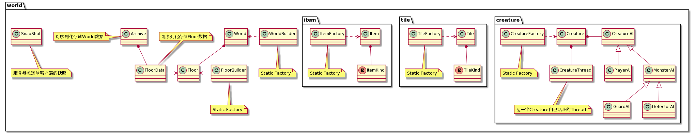
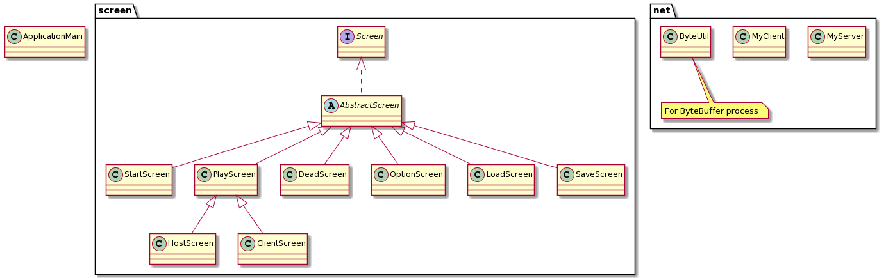

# 《Developing a Java Game from Scratch》

**可运行文件于Code/magicToer/target目录下**

## 开发目标

- **设计灵感**

​	设计灵感来源于小时候的游戏《魔塔》。确定选题之前，想到既要玩家怪物两方对战，有多种生物，加上道具，再加上像素地图，就打算按照魔塔的形式进行游戏的开发。

- **开发计划**

​	本身计划是将整个游戏设计为8层魔塔，经历打怪升级，最后在第八层打boss通关。

​	但因为现在纯属赶ddl提交，所以地图仅完成了前三层的设计，各项功能倒是全部实现了，只是地图设计远比想象的复杂，就暂时搁置了。

​	网络通信方面的实现，因为实在没有太好的办法将其加入原本的魔塔，所以做了一个单独的场景进行通信已经实现的展示。

- **实现内容**
  - 三种怪物：随机走动，侦测范围内追赶玩家，把守位置
  - 三种道具：增加攻击力，增加防御力，增加生命值
  - 三种物品：黄、蓝、红钥匙
  - 门：三种颜色，对应颜色钥匙才能打开
  - 楼梯：玩家进入即可上下楼层
  - 功能：保存、加载、多人游戏
  - 使用selector进行网络通信
  - 使用maven进行项目管理
  

**游戏截图 **

  

  

## 设计理念

- **代码总体设计**

  

  

  ​	主要分为 world、screen、net三个文件夹和一个ApplicationMain文件。

  ​	world：实现游戏所有基本元素部分

  ​	screen：实现游戏的各个运行状态

  ​	net：实现服务器和客户端

  ​	ApplicationMain：整合并运行游戏

- **设计原因**

  ​	尽可能得按照面向对象的模式进行代码编写，部分之间仅仅是信息传递，避免了耦合性过大造成“牵一发而动全身”的影响。

  ​	builder和factory都使用了静态工厂，避免了对工厂对象的管理，直接调用静态方法即可获得相应对象。

  ​	线程控制使用了ExecutorService和ScheduledExecutorService，前者进行长期运行Thread的执行，后者定期执行屏幕刷新和Creature的动作，以及网络通信相关线程。

  ​	保存和加载功能的实现，是通过实现可序列化的Archive类来保存World中的所有信息，以此进行读取和存储。

  ​	网络通信的实现，是通过客户端向服务器发送操作信息，服务器统一处理后向所有客户端发送SnapShot，客户端直接对SnapShot进行显示。

## 技术问题

- 在实现多楼层切换时，遇到无法仅仅运行当前楼层生物线程，并暂停其他楼层线程的问题。通过在切换楼层时调用当前线程池的shutDownNow，然后将下一楼层的所有生物线程放入新的线程池来解决。
- 保存和加载时不可以直接序列化world的问题，通过实现额外的Archive类解决。
- maven打包后的路径问题，通过调用classLoader的资源获取解决。
- maven打包后jdk不支持javaFX.utils.pair的问题，通过更换jdk依赖解决。
- 网络通信时无法确认客户端身份的问题，在第一次连接时服务器向客户端发送id，客户端收到后将其保存，在发送操作内容时在内容前加上id。
- 网络通信时不同步的问题，服务器不停发送当前状态下的快照，客户端不断读取，并且仅显示最新快照的方法解决。

